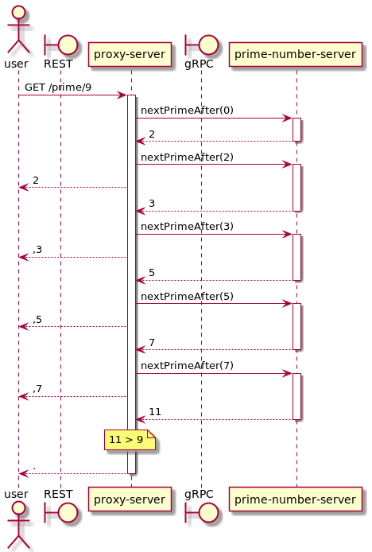
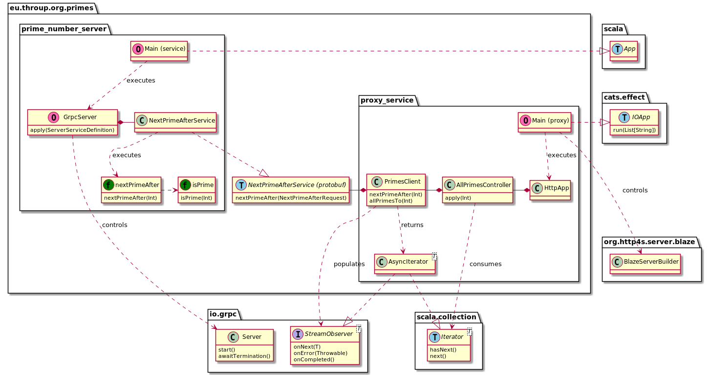
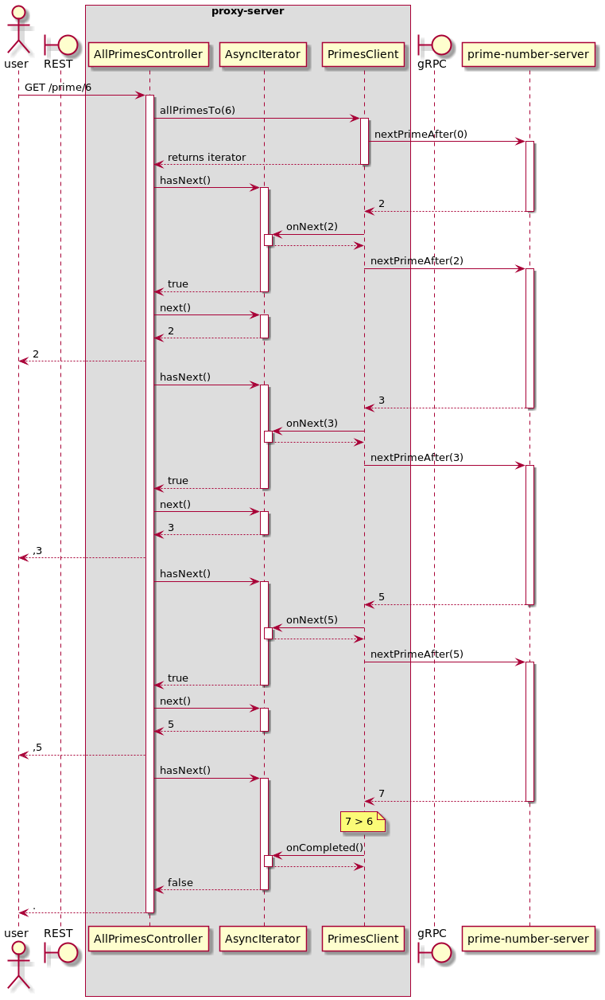

# Architecture
The overall architecture of this project is quite simple. <sup>[1](#footnote1)</sup>



* a user consumes the server over a Restful HTTP 1.1 API, provided by `proxy-server`.
* `proxy-server` translates this request into a sequence of gRPC calls to `prime-number-server` to get the "next prime
  after" the current number (starting from 0) until the requested limit is reached.
* the results are streamed back to the user as they are received by `proxy-server`, so they can begin consuming the list
  before all of the primes have been calculated.

The code for each component can be found in its own subproject in the codebase. Both subprojects depend on the
`protobuf` subproject, which contains the contract for communication over gRPC. Traits and stub classes for gRPC
communication are generated from the contract using the [ScalaPB](https://scalapb.github.io/) library.



## Design considerations

### Data format
The structure of the RESTful API response is based on a literal reading of the project brief:
> /prime/17 should return 2,3,5,7,11,13,17.

Consequently, if you make a `GET` call to `/prime/17`, the API will respond with the literal body,
`2,3,5,7,11,13,17.`, complete with commas, and terminating full stop.

This formatting is controlled by
[`AllPrimesController`](../proxy-service/src/main/scala/eu/throup/primes/proxy_service/AllPrimesController.scala).
Specifically the three constants:
```scala
  private[proxy_service] val Initiator = ""
  private[proxy_service] val Separator = ","
  private[proxy_service] val Terminator = "."
```
If a different format is required, these constants can easily be updated.

For example, to achieve an output like `(2,3,5,7,11,13,17)` use constants like:
```scala
private[proxy_service] val Initiator = "("
private[proxy_service] val Separator = ","
private[proxy_service] val Terminator = ")"
```

Or to get a list of one prime per line, terminated by `EOF`, use:
```scala
  private[proxy_service] val Initiator = ""
  private[proxy_service] val Separator = "\n"
  private[proxy_service] val Terminator = ""
```

I have assumed that, whatever format is really desired, these will not change regularly. For better customisation, these
could be enhanced to read in environment variables.

### Calculation of primes
The algorithm used to calculate primes is very naïve and definitely suboptimal. However, I have chosen to keep it this
way for now because _it does work_ and any optimisation will have both advantages and disadvantages of its own. If this
were a real world project, I would consider this the initial implementation ready to iterate upon as we learn more about
real-world usecases.

As currently implemented, the core algorithm is:
1. proxy initiates the process beginning with 0
2. proxy calls the service to get the next prime number
3. the service identifies primes by looping through every potential divisor to check if it is a factor 
4. when the next prime is identified, it is returned to the proxy
5. repeat from (2) until the limit is reached.

Depending on the real-world use cases, there are many potential optimisations which can be considered.
Some examples:

#### Use a "sieve" to identify all primes in a range
There are many more efficient algorithms to calculate all primes to a given limit. For example,
[the Sieve of Eratosthenes](https://en.wikipedia.org/wiki/Sieve_of_Eratosthenes). Whilst these algorithms are more
efficient when calculating a particular sequence of primes, it necessitates the calculation to be completed as a single
task. This makes it more complicated—if not impossible—to scale or pause the process.

#### Scaling the calculations
Because the current algorithm comprises a number of discrete steps (find the next prime after X), it is possible to use
server scaling to spread the calculation load. For example, three separate implementations could run behind a load
balancer, calculating successive primes. This is unlikely to optimise a single request to `GET /prime/x` but may provide
better efficiencies if there are a number of clients consuming the service simultaneously.

#### Caching
Like many expensive algorithms, the calculation of primes could be optimised by "throwing a cache at it". The most
expensive element of this process is actually identifying the primes. Depending on the real use cases, this could be
greatly optimised by the use of, for example, a Redis cache to store and retrieve previously identified primes.

In a more extreme case, it may even be beneficial to run this algorithm once and use the output to generate a client
library based on a lookup-table.

### Streaming data
Whilst gRPC provides support for streaming calls, I have not used this because of the optimisation considerations above.
If it was decided to refactor towards the use of a sieve, it could make sense to add a streaming `allPrimesTo` message
to the gRPC contract.

To support streaming with the current algorithm, I have implemented an `AsyncIterator`. This class implements both the
standard `Iterator` trait for consumption, and the `StreamObserver` interface from the gRPC library. This means that the
client could easily be refactored to consume a streaming gRPC message instead.


### Error handling
#### Input validation
The current implementation has very basic error handling, but it should be sufficient for most usage.

As both the gRPC definition, and the HTTP routing provided by [http4s](https://http4s.org/) is type-safe, it is not
possible to pass any non-integer values as input to the algorithm.

Any non-integers added to the path for the proxy server will result in a `404 Not found` response.

As integer input is guaranteed, there are no dangerous input values for the `isPrime` function. For the `nextPrimeAfter`
function, `Int.MaxValue` presents a problem because there are _no valid_ integers after it. In the event that value is
passed as input, an `IllegalArgumentException` will be thrown.

#### Network resilience
This implementation is _not_ resilient to any network outage. There is no specific error handling to react to dropped
connections between the two servers, or the proxy and its client.

This is an obvious area for improvement before considering the project for production use.

## Footnotes

<a id="footnote1" name="footnote1">1</a>: All of the diagrams on this page were generated with
[PlantUML](https://plantuml.com/). The source files can be found in [`plantuml`](plantuml).
